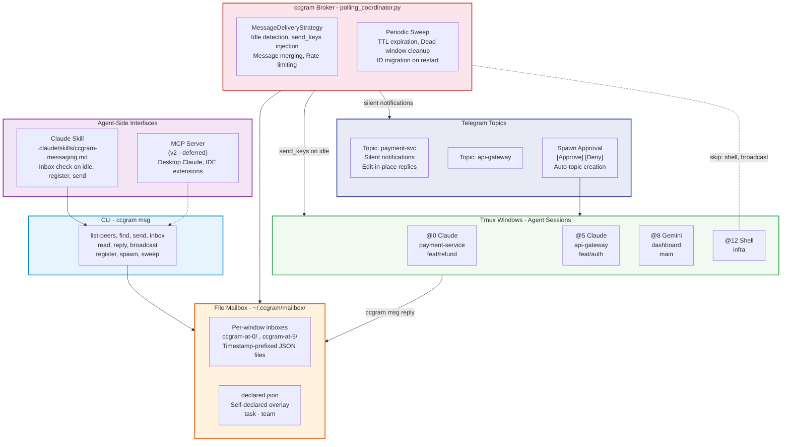
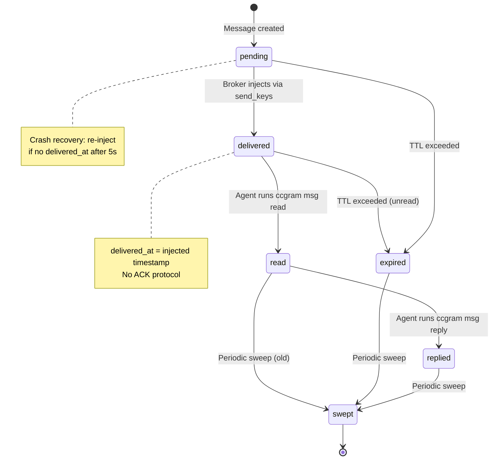
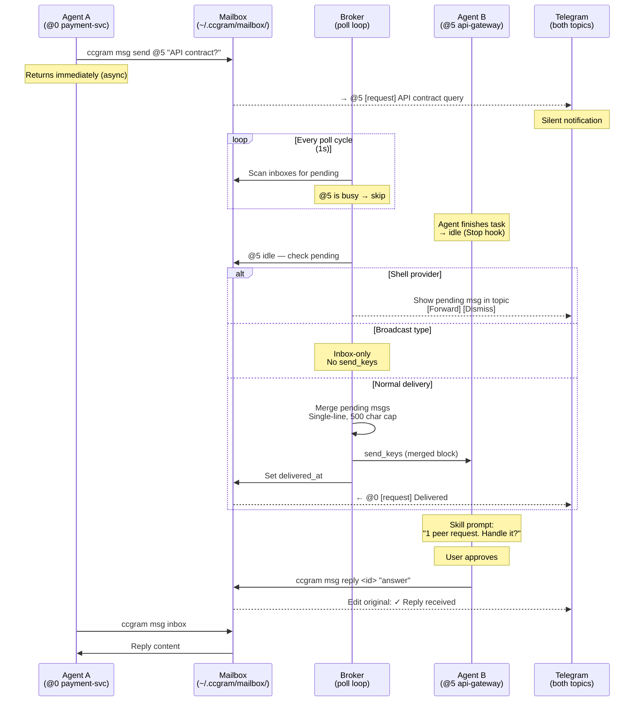
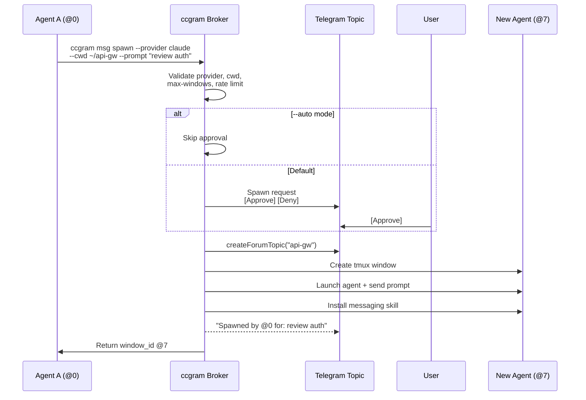
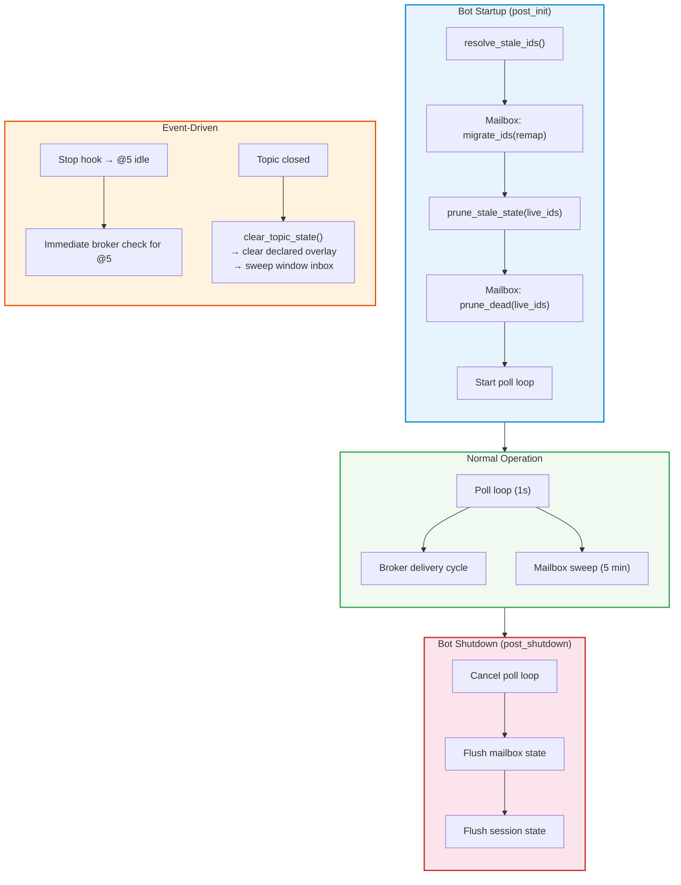

# Inter-Agent Messaging

## Overview

Add agent-to-agent messaging to ccgram, allowing AI coding agents running in different tmux windows to discover each other, exchange messages, broadcast notifications, and spawn new agents — with human oversight via Telegram.

**Problem:** Agents in ccgram tmux windows are isolated. Users manually relay information between agents via Telegram topics. For long-running multi-component work (microservices, monorepo modules, cross-repo integration), agents need direct collaboration.

**Solution:** File-based mailbox system + CLI (`ccgram msg`) + broker delivery via existing poll loop + Telegram visibility. Skill and MCP server as additional interfaces to the same CLI.

**Key design decisions (from brainstorm + 3-reviewer process):**

- Async-default messaging (`send` returns immediately; `--wait` opt-in)
- Broker-first delivery (send_keys injection on idle is primary; skill inbox-check is enhancement)
- Shell topic safety (never inject messages into shell windows)
- Silent Telegram notifications (inter-agent messages grouped, no push)
- Auto-attached context (cwd, branch, provider in every message)
- Deadlock prevention (one outstanding `--wait` per window)
- Per-type TTLs sized for human-in-the-loop Telegram workflows (60m–8h)
- Atomic writes for all mailbox/registry files (Maildir-inspired write-then-rename)
- Qualified mailbox IDs (`session:@N`) matching session_map convention — no bare `@N` collisions
- Broadcasts are inbox-only — no send_keys injection to avoid thundering herd
- send_keys injection: single-line, 500-char cap, file reference for long messages
- Registry is a view over existing SessionManager state + self-declared overlay, not a separate mirror
- Skill teaches agent to summarize peer messages to user and ask before processing
- Spawn auto-creates Telegram forum topic on approval

**Functional spec:** This plan was derived from the brainstorm spec reviewed by Perplexity, Codex, and Gemini. The spec content is preserved in the Context section below.

## Context

### Codebase patterns (from exploration, updated for modularity refactoring)

- **CLI:** Click group in `cli.py` with subcommands in separate `*_cmd.py` files (doctor_cmd.py, status_cmd.py pattern) — unchanged
- **State files:** `atomic_write_json()` in `utils.py` — write to tmp, fsync, rename. `StatePersistence` extracted to `state_persistence.py` (reusable for mailbox state)
- **Config:** Env vars read in `Config.__init__()`, flag-to-env mapping in `_FLAG_TO_ENV`, lazy import at command entry — unchanged
- **Poll loop:** `status_poll_loop()` in `handlers/polling_coordinator.py` (refactored from old `status_polling.py`) — 1s interval, time-gated periodic tasks. Strategy classes in `handlers/polling_strategies.py`
- **Thread routing:** Extracted to `thread_router.py` — topic↔window binding lookups now separate from SessionManager. Reverse index: `get_thread_for_window(user_id, window_id)` is O(1)
- **Hook events:** `HookEvent` dataclass → `dispatch_hook_event()` switch in `handlers/hook_events.py` — unchanged
- **Callback registration:** New `handlers/callback_registry.py` with self-registration pattern and longest-prefix matching (use for spawn approval callbacks: `sp:ok:*`, `sp:no:*`, loop alert: `ml:pause:*`, `ml:allow:*`)
- **No protocols.py:** Protocol interfaces were created and deleted during PR #47 (unused). Messaging module imports concrete classes directly (SessionManager, ThreadRouter) — same pattern as all other modules
- **Tests:** CliRunner for CLI, pytest fixtures, tests mirror source layout in `tests/ccgram/`

### Reusable patterns to leverage (DO NOT reinvent)

| Pattern                                    | Module                                                | Use in messaging                                                                                                                                                            |
| ------------------------------------------ | ----------------------------------------------------- | --------------------------------------------------------------------------------------------------------------------------------------------------------------------------- |
| **StatePersistence**                       | `state_persistence.py`                                | Reuse directly for `declared.json` overlay — debounced atomic saves with serialize callback                                                                                 |
| **Polling strategy classes**               | `handlers/polling_strategies.py`                      | Follow `TerminalStatusStrategy` pattern for `MessageDeliveryStrategy` — state-owning class with `get_state()`, `clear_state()`, module-level singleton                      |
| **Callback self-registration**             | `handlers/callback_registry.py`                       | `@register("sp:ok:", "sp:no:")` decorators on spawn approval handlers. Longest-prefix matching handles `sp:ok:<id>` dispatch. Same for loop alert `[Pause]/[Allow]` buttons |
| **Topic auto-creation with flood backoff** | `handlers/topic_orchestration.py`                     | Reuse `_create_topic_in_chat()` pattern for spawn auto-topic creation — per-chat `RetryAfter` backoff, graceful degradation on `TelegramError`                              |
| **Message queue + merging**                | `handlers/message_queue.py`                           | Route inter-agent Telegram notifications through existing `enqueue_content_message()` — automatic FIFO ordering, merging, rate limiting, dead worker respawning             |
| **Entity-based formatting + silent send**  | `entity_formatting.py` + `handlers/message_sender.py` | Use `safe_send()` with `disable_notification=True` for all inter-agent Telegram messages. Entity fallback chain handles parse errors. `rate_limit_send()` per-chat          |
| **Poll loop resilience**                   | `handlers/polling_coordinator.py`                     | Follow exponential backoff pattern (`_BACKOFF_MIN`/`_BACKOFF_MAX`) for broker delivery loop. Top-level `_LoopError` catch keeps loop alive                                  |
| **Direct imports (no Protocol layer)**     | `session.py`, `thread_router.py`                      | Import concrete singletons directly (`session_manager`, `thread_router`) — same pattern as all handler modules. Test via monkeypatch, not Protocol abstraction              |

### Files/components involved

| Area                  | Files                                                                                                                                                     |
| --------------------- | --------------------------------------------------------------------------------------------------------------------------------------------------------- |
| New CLI group         | `src/ccgram/msg_cmd.py` (new), `src/ccgram/cli.py` (add msg group)                                                                                        |
| Mailbox core          | `src/ccgram/mailbox.py` (new) — message CRUD, sweep                                                                                                       |
| Peer discovery        | `src/ccgram/msg_discovery.py` (new) — view over SessionManager + declared overlay                                                                         |
| Broker delivery       | `src/ccgram/handlers/msg_broker.py` (new) — idle delivery, rate limiting                                                                                  |
| Telegram integration  | `src/ccgram/handlers/msg_telegram.py` (new) — topic notifications                                                                                         |
| Spawn flow            | `src/ccgram/handlers/msg_spawn.py` (new) — approval, creation                                                                                             |
| Skill                 | `src/ccgram/msg_skill.py` (new) — skill file generation + install                                                                                         |
| Config                | `src/ccgram/config.py` (extend)                                                                                                                           |
| Poll loop integration | `src/ccgram/handlers/polling_coordinator.py` (extend — broker cycle + sweep)                                                                              |
| Hook integration      | `src/ccgram/handlers/hook_events.py` (extend — idle trigger for broker)                                                                                   |
| Callback registration | `src/ccgram/handlers/callback_registry.py` (extend — spawn approval callbacks)                                                                            |
| Thread routing        | `src/ccgram/thread_router.py` (import for topic↔window lookups in Telegram notifications)                                                                 |
| Lifecycle hooks       | `src/ccgram/session.py` (resolve_stale_ids, prune_stale_state), `src/ccgram/handlers/cleanup.py` (clear_topic_state), `src/ccgram/bot.py` (post_shutdown) |
| Tests                 | `tests/ccgram/test_mailbox.py`, `test_msg_cmd.py`, `test_msg_broker.py`, etc.                                                                             |

### Architecture



### Message types

| Type        | Behavior                                             | Sender blocks?           | Default TTL |
| ----------- | ---------------------------------------------------- | ------------------------ | ----------- |
| `request`   | Expects reply. Sender returns immediately by default | No (default) or `--wait` | 60 min      |
| `reply`     | Response to a request. Links via `reply_to`          | No                       | 120 min     |
| `notify`    | Fire-and-forget                                      | No                       | 240 min     |
| `broadcast` | Notify to every matching recipient's inbox           | No                       | 480 min     |

### Message lifecycle



### Message format

```json
{
  "id": "<timestamp>-<uuid>",
  "from": "ccgram:@0",
  "to": "ccgram:@5",
  "type": "request",
  "reply_to": null,
  "subject": "API contract query",
  "body": "What's your gRPC API contract for payment processing?",
  "context": {
    "cwd": "/home/user/payment-svc",
    "branch": "feat/refund",
    "provider": "claude"
  },
  "created_at": "2026-03-29T10:45:00Z",
  "delivered_at": null,
  "read_at": null,
  "status": "pending",
  "ttl_minutes": 60
}
```

### Registry (view over existing state + self-declared overlay)

The registry is NOT a separate file mirroring SessionManager state. It is a computed view:

- **Auto fields** (from `SessionManager` + `session_map.json`): window_id, name, provider, cwd, status
- **Auto field** (from git): branch
- **Self-declared overlay** (`~/.ccgram/mailbox/declared.json`): task, team — only the fields agents self-report

CLI `list-peers` / `find` merges both sources at query time. No `registry.json` file — avoids second source of truth and drift.

Example output (merged view):

```
 ID           Name              Provider  Status  CWD                  Branch             Task                    Team
 ccgram:@0    payment-service   claude    busy    ~/payment-svc        feat/refund        Implementing refund     backend
 ccgram:@5    api-gateway       claude    idle    ~/api-gateway        feat/auth          —                       backend
```

### Configuration

| Setting       | Env Var                    | Default              |
| ------------- | -------------------------- | -------------------- |
| Auto-spawn    | `CCGRAM_MSG_AUTO_SPAWN`    | `false`              |
| Max windows   | `CCGRAM_MSG_MAX_WINDOWS`   | `10`                 |
| Mailbox dir   | (follows config dir)       | `~/.ccgram/mailbox/` |
| Wait timeout  | `CCGRAM_MSG_WAIT_TIMEOUT`  | `60` (seconds)       |
| Spawn timeout | `CCGRAM_MSG_SPAWN_TIMEOUT` | `300` (seconds)      |
| Spawn rate    | `CCGRAM_MSG_SPAWN_RATE`    | `3` (per window/hr)  |
| Message rate  | `CCGRAM_MSG_RATE_LIMIT`    | `10` (per window/5m) |

## Development Approach

- **Testing approach**: TDD (tests first)
- Complete each task fully before moving to the next
- Make small, focused changes
- **CRITICAL: every task MUST include new/updated tests** for code changes in that task
- **CRITICAL: all tests must pass before starting next task** — no exceptions
- **CRITICAL: update this plan file when scope changes during implementation**
- Run `make fmt && make test && make lint` after each change
- Maintain backward compatibility (new `msg` subcommand, no changes to existing behavior)

## Testing Strategy

- **Unit tests**: required for every task (TDD — write first)
- **Integration tests**: for broker delivery (real tmux), Telegram dispatch (PTB \_do_post patch)
- **Test patterns**: CliRunner for CLI, tmp_path for mailbox dirs, monkeypatch for config

## Progress Tracking

- Mark completed items with `[x]` immediately when done
- Add newly discovered tasks with ➕ prefix
- Document issues/blockers with ⚠️ prefix
- Update plan if implementation deviates from original scope
- Keep plan in sync with actual work done

## Implementation Steps

### Task 1: Mailbox core — message storage layer

The foundation. File-based mailbox with atomic writes, message CRUD, TTL support. Uses qualified window IDs (`session:@N`) matching session_map convention.

- [x] write tests for `Mailbox` class: create inbox dir, write message, read message, list messages, acknowledge
- [x] write tests for qualified ID paths: `ccgram:@0/`, `emdash-claude-main-abc:@0/` — no bare `@N`
- [x] write tests for message ordering: `inbox()` returns FIFO by timestamp-prefixed filename
- [x] write tests for atomic write safety: partial write recovery, concurrent read during write
- [x] write tests for TTL expiration: message expires after ttl_minutes, expired messages filtered from inbox
- [x] write tests for message status transitions: pending → read → replied; pending → expired
- [x] implement `src/ccgram/mailbox.py`:
  - `Mailbox` class with `base_dir` (default `~/.ccgram/mailbox/`)
  - `send(from_id, to_id, body, type, subject, ttl_minutes, reply_to, file_path)` → writes msg JSON to `{to_id}/{timestamp}-{short_uuid}.json` via atomic write (tmp + rename)
  - `inbox(window_id)` → list pending messages for window, sorted by filename (FIFO), filtered by TTL
  - `read(msg_id, window_id)` → mark message as read, set `read_at`
  - `reply(msg_id, window_id, body)` → create reply message linked via `reply_to`, mark original as `replied`
  - `sweep(window_id=None)` → remove expired + old read messages; `try/except FileNotFoundError` on every file read (race-safe with concurrent sweep)
  - `migrate_ids(old_to_new: dict)` → rename mailbox dirs on window ID remap (called from window_resolver)
  - `prune_dead(live_ids: set)` → remove mailbox dirs for windows not in live_ids (called from prune_stale_state)
  - `pending_undelivered(min_age_seconds=5)` → find messages without `delivered_at` older than threshold (for crash recovery re-injection)
  - Per-type TTL defaults: request=60m, reply=120m, notify=240m, broadcast=480m
  - Auto-attach context (cwd from session_map, branch from `git rev-parse`, provider from session_manager)
  - Body size limit: 10KB hard cap, `--file` for larger payloads (stores path reference)
  - All directory scans via `os.scandir()` (batches readdir + stat)
- [x] write tests for `--file` support: body loaded from file path, 10KB limit enforcement
- [x] write tests for FileNotFoundError resilience: sweep deletes file while reader iterates — no crash
- [x] write tests for `prune_dead()`: removes dirs for dead windows, preserves foreign (emdash) windows
- [x] write tests for `pending_undelivered()`: returns only messages older than min_age without delivered_at
- [x] run `make fmt && make test && make lint` — must pass

### Task 2: Peer discovery (view over existing state + self-declared overlay)

NOT a separate registry file. Discovery reads from SessionManager + session_map (auto fields) and a small `declared.json` overlay (task, team).

- [ ] write tests for `list_peers()`: merges SessionManager data with declared overlay, returns full view
- [ ] write tests for filtering: by provider, team, cwd glob pattern
- [ ] write tests for self-declared overlay: register task/team, update, clear on window death
- [ ] write tests for branch detection: `git rev-parse` in window's cwd
- [ ] implement in `src/ccgram/msg_discovery.py`:
  - `list_peers(session_manager, thread_router, filter_provider, filter_team, filter_cwd)` → query SessionManager for window_id, name, provider, cwd, status; use `thread_router` for topic bindings; enrich with branch (git) and self-declared fields from `declared.json`
  - `register_declared(window_id, task, team)` → update self-declared overlay
  - `clear_declared(window_id)` → remove entry on window death
  - **Reuse `StatePersistence`** for `declared.json` — debounced atomic saves with `serialize_fn` callback, same pattern as SessionManager state
  - No `registry.json` — avoids second source of truth
  - Filter cwd via `fnmatch` on the path
- [ ] run `make fmt && make test && make lint` — must pass

### Task 3: CLI subcommand group — `ccgram msg`

Click group with subcommands for all operations. Following existing pattern (cli.py + msg_cmd.py).

- [ ] write tests for CLI help and subcommand routing: `ccgram msg --help`, `ccgram msg list-peers --help`
- [ ] write tests for `list-peers` command: table output, `--json` output, empty state
- [ ] write tests for `find` command: filter by provider, team, cwd pattern
- [ ] write tests for `send` command: basic send, `--notify`, `--wait`, `--ttl`, `--file`
- [ ] write tests for `inbox` command: show pending, `--json`, empty inbox
- [ ] write tests for `read` command: mark message read, unknown msg-id error
- [ ] write tests for `reply` command: create reply, link to original, `--file`
- [ ] write tests for `broadcast` command: send to all, filtered by team/provider/cwd
- [ ] write tests for `register` command: set task/team, update task
- [ ] write tests for `sweep` command: clean expired, `--force` cleans all read
- [ ] implement `src/ccgram/msg_cmd.py`:
  - `msg_main` Click group
  - Subcommands: `list-peers`, `find`, `send`, `inbox`, `read`, `reply`, `broadcast`, `register`, `sweep`
  - Window self-identification: `CCGRAM_WINDOW_ID` env var (primary), tmux runtime detection (fallback)
  - `send` default is async (return immediately); `--wait` blocks with poll loop + timeout (`CCGRAM_MSG_WAIT_TIMEOUT`)
  - `--wait` deadlock prevention: fail if sender already has pending outbound `--wait`
  - Message rate limiting: max `CCGRAM_MSG_RATE_LIMIT` per window per 5 min
  - All output: table format (human) or `--json` (machine)
- [ ] register `msg` group in `src/ccgram/cli.py` (add to cli group, lazy import pattern)
- [ ] run `make fmt && make test && make lint` — must pass

### Task 4: Config extensions

Add new env vars to Config for all messaging settings.

- [ ] write tests for new config values: defaults, env var override, config-dir mailbox path
- [ ] extend `src/ccgram/config.py`:
  - `msg_auto_spawn: bool` from `CCGRAM_MSG_AUTO_SPAWN` (default: False)
  - `msg_max_windows: int` from `CCGRAM_MSG_MAX_WINDOWS` (default: 10)
  - `msg_wait_timeout: int` from `CCGRAM_MSG_WAIT_TIMEOUT` (default: 60)
  - `msg_spawn_timeout: int` from `CCGRAM_MSG_SPAWN_TIMEOUT` (default: 300)
  - `msg_spawn_rate: int` from `CCGRAM_MSG_SPAWN_RATE` (default: 3)
  - `msg_rate_limit: int` from `CCGRAM_MSG_RATE_LIMIT` (default: 10)
  - `mailbox_dir: Path` derived from config_dir / `mailbox`
- [ ] add CLI flag mappings to `_FLAG_TO_ENV` in `cli.py` (for flags that make sense on `run` command)
- [ ] run `make fmt && make test && make lint` — must pass

### Task 5: Broker delivery — idle detection + send_keys injection

The active delivery layer. Piggybacks on existing poll loop. Injects messages into idle agent windows. **Follow `TerminalStatusStrategy` pattern** from `polling_strategies.py` for state management. **Follow `polling_coordinator.py` pattern** for loop resilience (exponential backoff, top-level error catch).

- [ ] write tests for broker delivery logic: detect idle → select pending message → format → deliver
- [ ] write tests for shell topic safety: messages to shell windows are NOT delivered via send_keys
- [ ] write tests for provider-specific idle detection: Claude (Stop hook), Codex/Gemini (activity heuristic)
- [ ] write tests for `delivered_at` timestamp: set on successful injection
- [ ] write tests for message rate limiting enforcement in broker
- [ ] write tests for broadcast skip: broadcast-type messages are never injected via send_keys
- [ ] write tests for message merging: multiple pending messages merged into one send_keys call
- [ ] write tests for injection format: single-line, 500 char cap, file reference for long bodies
- [ ] write tests for loop detection: 5+ exchanges between same pair in 10 min → pause + alert
- [ ] implement `src/ccgram/handlers/msg_broker.py`:
  - `MessageDeliveryStrategy` class following `TerminalStatusStrategy` pattern: state-owning with `get_state(window_id)`, `clear_state(window_id)`, module-level singleton. Tracks per-window delivery state (pending count, last delivery time, rate counters, loop detection counters)
  - `async def broker_delivery_cycle(bot)` — called from poll loop with exponential backoff (`_BACKOFF_MIN`/`_BACKOFF_MAX`), top-level `_LoopError` catch. Checks all inboxes for pending messages
  - For each idle window with pending messages:
    - Skip shell-provider windows (inbox-only)
    - Skip broadcast-type messages (inbox-only, prevents thundering herd)
    - Collect all eligible pending messages for the window
    - Merge into single injection block (FIFO, `---` separator between messages)
    - Format: single-line per message, 500 char cap, file ref for long bodies
    - One `send_keys` call with merged block
    - Set `delivered_at` on all delivered messages
  - Rate limiting: track sends per window, enforce `CCGRAM_MSG_RATE_LIMIT`
  - Loop detection: track message counts between window pairs, pause at threshold
  - At-least-once delivery: if crash after send_keys but before `delivered_at` write, message is re-injected on next cycle (acceptable — UUID prevents ambiguity)
- [ ] write tests for crash recovery: pending messages without `delivered_at` (older than 5s) are re-injected on startup
- [ ] integrate into `src/ccgram/handlers/polling_coordinator.py`:
  - Add `broker_delivery_cycle()` call in main poll loop (every cycle or every N seconds)
  - Add periodic `mailbox.sweep()` call (every 5 minutes, time-gated like topic check)
- [ ] integrate idle detection from hook events: extend `_handle_stop()` in `hook_events.py` to trigger immediate broker delivery check for that window
- [ ] integrate recovery hooks into existing lifecycle:
  - `session.resolve_stale_ids()` → call `mailbox.migrate_ids(remap_dict)` for dir renames
  - `session.prune_stale_state()` → call `mailbox.prune_dead(live_ids)` to remove dead window mailboxes
  - `handlers/cleanup.clear_topic_state()` → clear declared overlay entry + sweep window inbox (lazy import pattern)
  - `bot.post_shutdown()` → flush any pending mailbox state (after monitor.stop(), before state flush)
- [ ] run `make fmt && make test && make lint` — must pass

### Task 6: Telegram integration — visibility and notifications

Inter-agent messages shown in Telegram topics, silent by default, grouped. **Route all notifications through existing `message_queue.py`** (`enqueue_content_message`) — automatic FIFO ordering, merging, rate limiting, dead worker respawning. **Use `safe_send`/`safe_edit`** from `message_sender.py` with `disable_notification=True`. **Use `thread_router.get_thread_for_window()`** for O(1) window→topic resolution.

- [ ] write tests for message notification formatting: sender info, subject, body preview
- [ ] write tests for notification grouping: multiple messages merged into single Telegram message
- [ ] write tests for silent delivery: notifications don't trigger push (disable_notification=True)
- [ ] write tests for shell topic pending message display: show message in topic since send_keys is skipped
- [ ] write tests for loop detection alert: inline keyboard `[Pause] [Allow 5 more]` in Telegram
- [ ] implement `src/ccgram/handlers/msg_telegram.py`:
  - `async def notify_message_sent(bot, from_window, to_window, message)` — compact line in sender's topic: `→ @5 (auth-svc) [request] API contract query`
  - `async def notify_message_delivered(bot, from_window, to_window, message)` — compact line in recipient's topic: `← @0 (payment-svc) [request] API contract query`
  - `async def notify_reply_received(bot, original_msg, reply_msg)` — edit original sender-topic message in-place to show `✓ Reply received [View reply]`
  - `async def notify_pending_shell(bot, window_id, message)` — show pending message in shell topic with `[Forward to agent] [Dismiss]` keyboard
  - `async def notify_broadcast_sent(bot, from_window, recipients, message)` — single summary in sender's topic listing all recipients
  - `async def notify_loop_detected(bot, window_a, window_b)` — alert with `[Pause Messaging] [Allow 5 more]` keyboard
  - All notifications use `disable_notification=True` (silent)
  - Use existing `safe_send()` / `safe_edit()` helpers for entity formatting
- [ ] wire notifications into broker delivery and CLI send paths
- [ ] run `make fmt && make test && make lint` — must pass

### Task 7: Broadcast messaging

Filtered broadcast: send a notify to all matching peers.

- [ ] write tests for broadcast to all peers
- [ ] write tests for filtered broadcast: by team, provider, cwd pattern
- [ ] write tests for broadcast TTL (480 min default)
- [ ] write tests for broadcast Telegram visibility: single summary message, not per-recipient
- [ ] implement broadcast in `Mailbox.broadcast()`:
  - Write one message file per matching recipient inbox
  - Filter by team, provider, cwd glob pattern (using `fnmatch`)
  - Type is `notify` with 480 min TTL
  - Telegram: single summary notification in sender's topic listing recipients
- [ ] wire into CLI `broadcast` subcommand (already stubbed in Task 3)
- [ ] run `make fmt && make test && make lint` — must pass

### Task 8: Agent spawning with Telegram approval

Agents request new agent instances. Requires Telegram approval by default. **Reuse `topic_orchestration._create_topic_in_chat()` pattern** for auto-topic creation with per-chat `RetryAfter` backoff. **Use `@register("sp:ok:", "sp:no:")` decorator** from `callback_registry.py` for approval button handlers.

- [ ] write tests for spawn request creation: validate provider, cwd, max-windows check
- [ ] write tests for spawn rate limiting: max N per window per hour
- [ ] write tests for approval flow: approve callback creates window, deny callback returns error
- [ ] write tests for auto-mode: `--auto` bypasses approval but not max-windows or rate limits
- [ ] write tests for spawn timeout: unapproved request expires after `CCGRAM_MSG_SPAWN_TIMEOUT`
- [ ] write tests for context bootstrap: `--context` file attached to spawn
- [ ] implement `src/ccgram/handlers/msg_spawn.py`:
  - `async def handle_spawn_request(bot, requester_window, provider, cwd, prompt, context_file, auto)`:
    - Validate provider exists, cwd exists, max-windows not exceeded
    - Rate limit check (per window per hour)
    - If `--auto` or `CCGRAM_MSG_AUTO_SPAWN`: create immediately
    - Else: post inline keyboard to requester's Telegram topic `[Approve] [Deny]`
    - On approve: auto-create Telegram forum topic (`createForumTopic`), create tmux window, bind topic to window, launch agent, send initial prompt, install skill, post "Spawned by @N for: task" in new topic, return window_id
    - On deny: return error to requester
    - On timeout: cancel request, return timeout error
  - Callback data: `CB_SPAWN_APPROVE = "sp:ok:<request_id>"`, `CB_SPAWN_DENY = "sp:no:<request_id>"`
- [ ] register spawn callbacks via `handlers/callback_registry.py` self-registration pattern
- [ ] wire into CLI `spawn` subcommand
- [ ] run `make fmt && make test && make lint` — must pass

### Task 9: Skill auto-installation

Install messaging skill prompt to Claude Code agents so they check inbox on idle.

- [ ] write tests for skill file generation: correct prompt content, correct path
- [ ] write tests for skill installation: writes to correct directory, idempotent
- [ ] write tests for skill content: includes register, inbox check, send, broadcast instructions
- [ ] implement `src/ccgram/msg_skill.py`:
  - `SKILL_CONTENT` — prompt text teaching the agent about messaging:
    - Register on start: `ccgram msg register --task "..." --team "..."`
    - Check inbox on idle: `ccgram msg inbox`
    - **Critical: summarize peer messages to user and ask before processing** — "I have N requests from other agents. Should I handle these?" (prevents agent being "hijacked" by peer messages without user consent)
    - Exception: `--auto` spawned agents (no user topic) process immediately
    - Send/find/broadcast/spawn commands
  - `install_skill(cwd: Path)` — write skill file to `{cwd}/.claude/skills/ccgram-messaging.md` (per-project, scoped)
  - `ensure_skill_installed(window_id)` — check if skill exists for window's cwd, install if missing
  - Idempotent: skip if file already exists with same content
- [ ] integrate skill install into spawn flow (Task 8) and optionally into topic creation for Claude windows
- [ ] run `make fmt && make test && make lint` — must pass

### Task 10: Window self-identification

Ensure agents can identify their own window ID for CLI operations.

- [ ] write tests for self-identification: env var present → use it; absent → tmux fallback; outside tmux → error
- [ ] implement in `msg_cmd.py`:
  - `get_my_window_id()` → reads `CCGRAM_WINDOW_ID` env var (primary)
  - Fallback: `tmux display-message -p -t $TMUX_PANE '#{window_id}'`
  - Error if neither works (not in tmux)
- [ ] set `CCGRAM_WINDOW_ID` env var when ccgram creates tmux windows (extend `tmux_manager.create_window()`)
- [ ] run `make fmt && make test && make lint` — must pass

### Task 11: Verify acceptance criteria

- [ ] verify all message types work end-to-end: request, reply, notify, broadcast
- [ ] verify broker delivery works: message sent → idle detected → injected via send_keys → reply captured
- [ ] verify shell safety: messages to shell windows stay in mailbox, shown in Telegram topic
- [ ] verify deadlock prevention: `--wait` with existing pending outbound fails immediately
- [ ] verify TTL expiration: expired messages not shown in inbox, swept by periodic cleanup
- [ ] verify spawn approval flow: request → Telegram keyboard → approve → auto-topic created → window created
- [ ] verify Telegram visibility: messages appear in both topics, silent, grouped
- [ ] verify crash recovery: simulate unclean shutdown, restart, pending messages re-injected
- [ ] verify ID migration: simulate tmux restart (window IDs change), mailbox dirs renamed correctly
- [ ] verify dead window cleanup: kill a window, verify mailbox dir pruned on next poll cycle
- [ ] verify concurrent sweep safety: no crashes when sweep runs during inbox read (FileNotFoundError handled)
- [ ] verify foreign window respect: emdash window mailboxes not swept or pruned
- [ ] verify discovery fluency: `list-peers` shows accurate data from SessionManager, not stale file
- [ ] verify rate limiting: exceeding message or spawn rate returns error
- [ ] verify registry auto-population: window state reflected without manual registration
- [ ] run full test suite: `make fmt && make test && make lint && make typecheck`

### Task 12: Update documentation

- [ ] update `CLAUDE.md` with `ccgram msg` command reference and design summary
- [ ] update `docs/plans/` — mark this plan complete
- [ ] add messaging section to architecture rule file (`.claude/rules/architecture.md`)

## Technical Details

### File layout

```
~/.ccgram/mailbox/
  declared.json                     # Self-declared overlay (task, team per window)
  ccgram:@0/                        # Qualified window inbox (matches session_map key format)
    tmp/                            # In-flight writes (atomic write staging)
    1743250000-abc123.json          # Timestamp-prefixed for FIFO ordering
  ccgram:@5/
    tmp/
    1743250001-def456.json
  emdash-claude-main-abc:@0/       # Foreign window inboxes use same qualified ID
    tmp/
```

**Mailbox ID format:** `<tmux_session>:<window_id>` — same convention as `session_map.json` keys. Prevents collisions across tmux sessions and multi-instance setups.

**Message filename:** `<unix_timestamp>-<short_uuid>.json` — sortable by creation time for FIFO ordering. `inbox()` returns messages sorted by filename (oldest first).

**ID migration on restart:** When `resolve_stale_ids()` remaps window IDs (e.g., `@5 → @7`), the mailbox directories are renamed to match. Piggyback on existing `window_resolver.py` migration logic.

### Delivery flow



### Spawn approval flow



### send_keys injection format

Messages injected via send_keys are flattened to a single line (Claude Code submits on newline). Format:

```
[MSG <id> from @0 (payment-svc, feat/refund)] API contract query: What's your gRPC API contract? REPLY WITH: ccgram msg reply <id> "your answer"
```

**Rules:**

- Newlines replaced with spaces (paragraphs with `|`)
- Hard cap: 500 chars for injection text
- Bodies > 500 chars: write full body to `~/.ccgram/mailbox/<window>/tmp/deliver-<id>.txt`, inject reference: `[MSG <id>] See: ~/.ccgram/mailbox/.../deliver-<id>.txt`
- Multiple pending messages: merged into one block with `---` separator, one send_keys call
- Special chars safe via tmux `-l` flag (existing `literal=True` path)

### `--wait` UX

When sender blocks with `--wait`:

- Immediate output: `Waiting for reply from @5 (api-gateway)... timeout: 60s`
- Progress: `... 30s elapsed` every 10s
- Poll interval: 0.5s using `time.monotonic()` deadline
- Ctrl-C: cancels the wait only (message stays in recipient's inbox, not retracted)
- Timeout: prints error, exits non-zero

### Safety rules

- **Atomic writes:** All message + overlay writes via write-to-tmp + fsync + rename (existing `atomic_write_json` pattern)
- **Shell safety:** Never inject messages into shell-provider windows via send_keys
- **Broadcast safety:** Broadcasts are inbox-only — never injected via send_keys (prevents thundering herd)
- **Deadlock prevention:** Max one outstanding `--wait` per window; fail if already blocking
- **Rate limiting:** Max 10 messages/5min per window; max 3 spawns/hour per window
- **Loop detection:** If two windows exchange 5+ messages in 10 min without user intervention, broker pauses delivery and alerts user in Telegram: "Agents @0 and @5 seem to be in a loop. [Pause] [Allow 5 more]"
- **Body size limit:** 10KB hard limit on message body. `--file` for larger payloads (file path reference, not inline)
- **TTL expiry:** Wakes blocking `--wait` sender with timeout error
- **Sweep:** Periodic cleanup every 5 min in poll loop; session cleanup on window death
- **ID migration:** Mailbox dirs renamed when `resolve_stale_ids()` remaps window IDs after tmux restart

### Reliability model

**At-least-once delivery.** The broker may occasionally deliver a message twice (crash after send_keys, before writing `delivered_at`). This is acceptable — idempotent messages (notifications, status updates) tolerate duplicates, and the UUID in the message prevents ambiguity.

**Delivery confirmation:** `delivered_at` = "broker injected via send*keys." Whether the agent \_acts* on it is the agent's problem. No ACK protocol — the terminal is a black box. Agent behavior change (hook events, topic emoji) serves as indirect confirmation.

**File access safety:** All mailbox file reads use `try/except FileNotFoundError` — never stat-then-read. POSIX unlink semantics protect open file descriptors during concurrent sweep.

**Directory scanning:** `os.scandir()` for inbox reads (batches readdir + stat). At 10 windows × ~5 messages each, this is ~0.1ms per poll cycle. No performance concern.

### Recovery model

**Crash recovery on startup:** Scan all inboxes. Messages without `delivered_at` older than 5 seconds are re-injected on next idle cycle. Messages with `delivered_at` are skipped.

**Partial broadcast failure:** If the process crashes after writing K of N broadcast messages, the remaining recipients simply miss the notification. No manifest or transactional writes — log the failure and move on.

**Integration hooks (matching existing ccgram recovery architecture):**

| Hook                     | Where                                  | What                                                                       |
| ------------------------ | -------------------------------------- | -------------------------------------------------------------------------- |
| **Startup ID migration** | `session.resolve_stale_ids()`          | Rename mailbox dirs when window IDs change after tmux restart              |
| **Startup prune**        | `session.prune_stale_state()`          | Remove mailbox dirs for dead windows not in live_ids                       |
| **Topic close cleanup**  | `handlers/cleanup.clear_topic_state()` | Clear declared overlay entry, sweep window's inbox                         |
| **Graceful shutdown**    | `bot.post_shutdown()`                  | Flush any pending mailbox state (after monitor.stop(), before state flush) |

**Foreign window respect:** Emdash windows (identified by ":" in session name) are never swept or pruned — they're owned by external tools.

### Recovery and lifecycle integration



## Post-Completion

**Manual verification:**

- Test with 2+ Claude Code instances in separate tmux windows sending messages
- Test cross-provider: Claude → Codex message delivery
- Test shell safety: verify message to shell window stays in mailbox
- Test Telegram notification grouping with 5+ rapid inter-agent messages
- Test spawn approval flow via real Telegram inline keyboard + auto-topic creation
- Test loop detection: rapid A↔B exchange triggers pause alert
- Test mailbox ID migration: restart tmux, verify mailbox dirs renamed correctly
- Test `--wait` UX: progress output, Ctrl-C cancellation, timeout error

**Future work (from reviewer feedback — not in this plan):**

- MCP server wrapping CLI for Desktop Claude / IDE integration
- Observer/watch pattern for monitoring other windows
- Claim/accept/decline flow for request ownership
- Human message relay from Telegram UI
- Advisory file locking for shared worktrees
- Parent/child lifecycle linking for spawned agents
- Transcript injection for spawn context
- Self-declared capability tags for discovery
